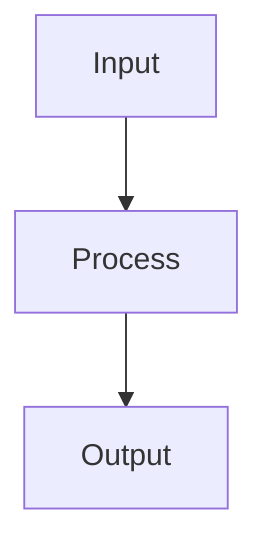

# mdr — Markdown Reader

A lightweight, fast Markdown viewer with Mermaid diagram support and live reload. Built in Rust.

## Why mdr?

**Built for the LLM era.** AI tools generate Markdown constantly — code documentation, technical specs, analysis reports — packed with diagrams, tables, and structured content. You need a fast way to read them.

Most developers end up previewing Markdown in VS Code, pasting into a browser, or squinting at raw text in the terminal. None of these handle Mermaid diagrams. None are instant. mdr is.

- **One command** — `mdr file.md` and you're reading, not editing
- **Native Rust binary** — no Electron, no Node.js, no npm, starts in milliseconds
- **Mermaid diagrams** — flowcharts, sequence diagrams, pie charts rendered as SVG natively (no headless browser)
- **Three backends** — full GUI (egui), native webview (WebKit/WebView2), or terminal UI (TUI) over SSH
- **Live reload** — edit your file or let your AI tool regenerate it, see changes instantly
- **In-document search** — Ctrl+F / `/` to find text across all backends

## Backends

mdr offers multiple rendering backends, selectable at runtime:

| Backend | Stack | Strengths |
|---------|-------|-----------|
| **egui** (default) | Pure Rust GPU rendering | Single static binary, fast startup, cross-platform |
| **webview** | OS native WebView (WebKit/WebView2) | GitHub-quality HTML/CSS rendering, full CSS support |
| **tui** | Terminal UI (ratatui + crossterm) | Works over SSH, no GUI needed, keyboard-driven |

## Install

### From source

```bash
git clone https://github.com/CleverCloud/mdr.git
cd mdr
cargo install --path .
```

### Build with specific backends only

```bash
# egui only (smaller binary, no WebView dependency)
cargo install --path . --no-default-features --features egui-backend

# webview only
cargo install --path . --no-default-features --features webview-backend
```

### Homebrew (macOS/Linux)

```bash
brew tap CleverCloud/misc
brew install mdr
```

### Nix

```bash
nix run github:CleverCloud/mdr
```

### Pre-built binaries

Download from the [Releases](https://github.com/CleverCloud/mdr/releases) page for macOS, Linux, and Windows.

## Usage

```bash
# Open with default backend (egui)
mdr README.md

# Open with webview backend
mdr --backend webview README.md

# Open in terminal (TUI)
mdr --backend tui README.md

# Show help
mdr --help
```

### TUI keybindings

| Key | Action |
|-----|--------|
| `q` / `Esc` | Quit |
| `j` / `↓` | Scroll down |
| `k` / `↑` | Scroll up |
| `Space` / `PgDn` | Page down |
| `PgUp` | Page up |
| `g` / `Home` | Go to top |
| `G` / `End` | Go to bottom |
| `Tab` | Switch focus between TOC and content |
| `Enter` | Navigate to selected TOC heading |
| `/` or `Ctrl+F` | Open search |
| `n` | Next search match |
| `N` | Previous search match |

## Features

- **Full GFM support** — tables, task lists, strikethrough, footnotes, autolinks
- **Syntax highlighting** — code blocks with language detection (via syntect)
- **Mermaid diagrams** — flowcharts, sequence diagrams, pie charts, and more (via mermaid-rs-renderer)
- **Table of Contents** — auto-generated sidebar from headings with click-to-navigate
- **Live reload** — file watching with 300ms debounce, updates on save
- **Dark/Light theme** — follows OS theme (webview backend)

## Mermaid Support

Mermaid code fences are rendered as SVG diagrams:

````markdown

````

Supported diagram types: flowchart, sequence, pie, class, state, ER, gantt.

> **Note**: Diamond/decision nodes (`{text}`) are not yet supported by the underlying renderer. Use square brackets as a workaround.

## Architecture

```
src/
├── main.rs              # CLI (clap), backend dispatch
├── core/
│   ├── markdown.rs      # GFM parsing (comrak) + CSS
│   ├── mermaid.rs       # Mermaid → SVG rendering
│   ├── toc.rs           # Heading extraction for TOC
│   ├── search.rs       # In-document search
│   └── watcher.rs       # File watching (notify, 300ms debounce)
└── backend/
    ├── egui.rs          # egui/eframe backend
    ├── tui.rs           # ratatui/crossterm TUI backend
    └── webview.rs       # wry/tao WebView backend
```

## Building

Requires Rust 1.75+.

```bash
# All backends (default)
cargo build --release

# Run tests
cargo test

# Run clippy
cargo clippy
```

### Linux dependencies

```bash
sudo apt-get install libgtk-3-dev libwebkit2gtk-4.1-dev libxdo-dev libgl1-mesa-dev
```

## Releases

Pre-built binaries are available on the [Releases](https://github.com/CleverCloud/mdr/releases) page for:
- macOS (Apple Silicon + Intel)
- Linux (x86_64)
- Windows (x86_64)

To create a release, push a version tag:

```bash
git tag v0.1.0
git push origin v0.1.0
```

## License

MIT

## Contributing

Issues and PRs welcome at [github.com/CleverCloud/mdr](https://github.com/CleverCloud/mdr).
