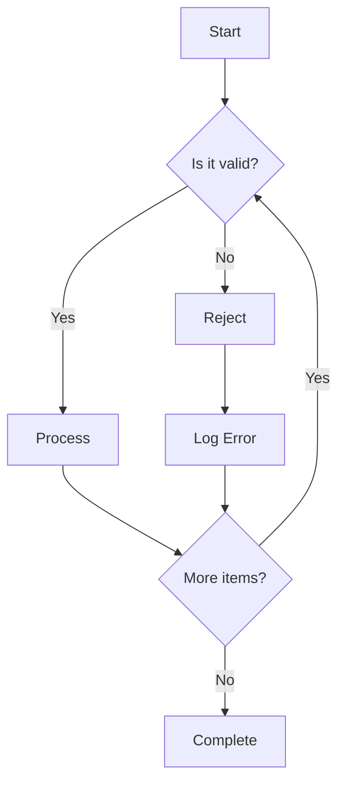
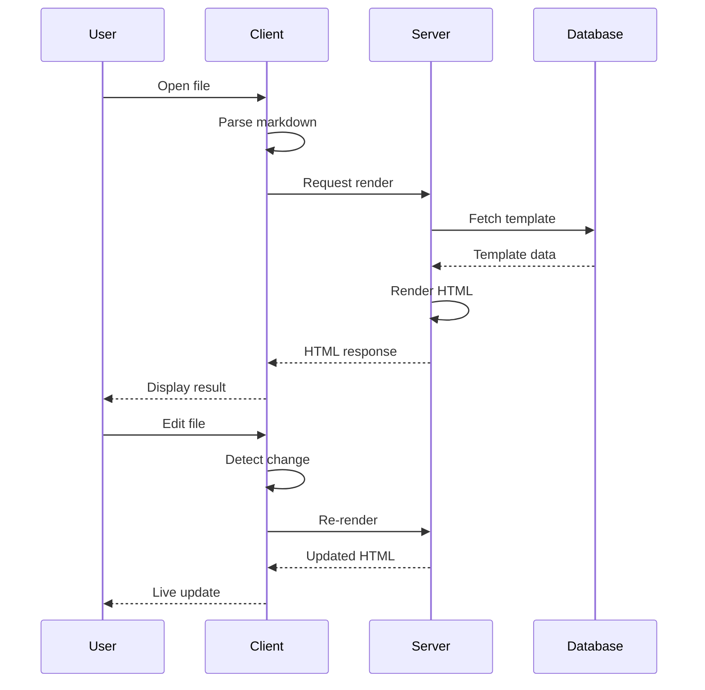
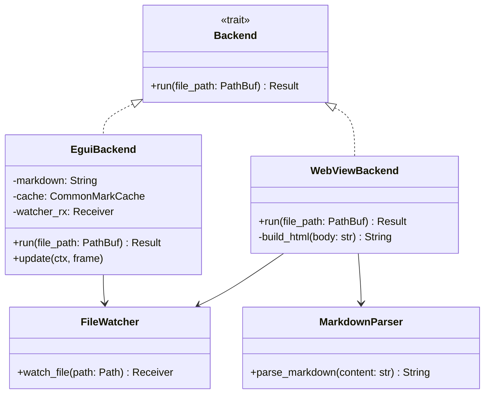
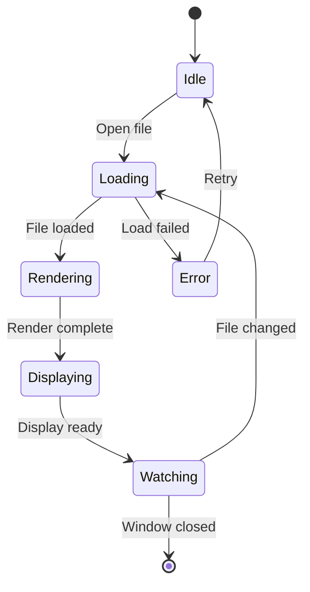
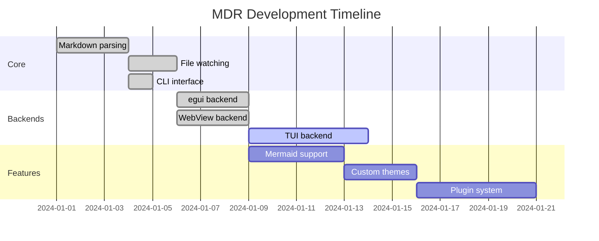
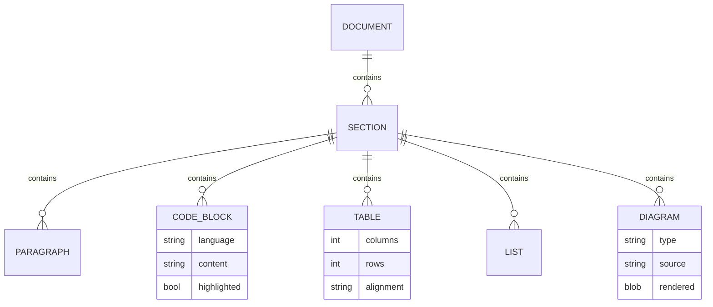
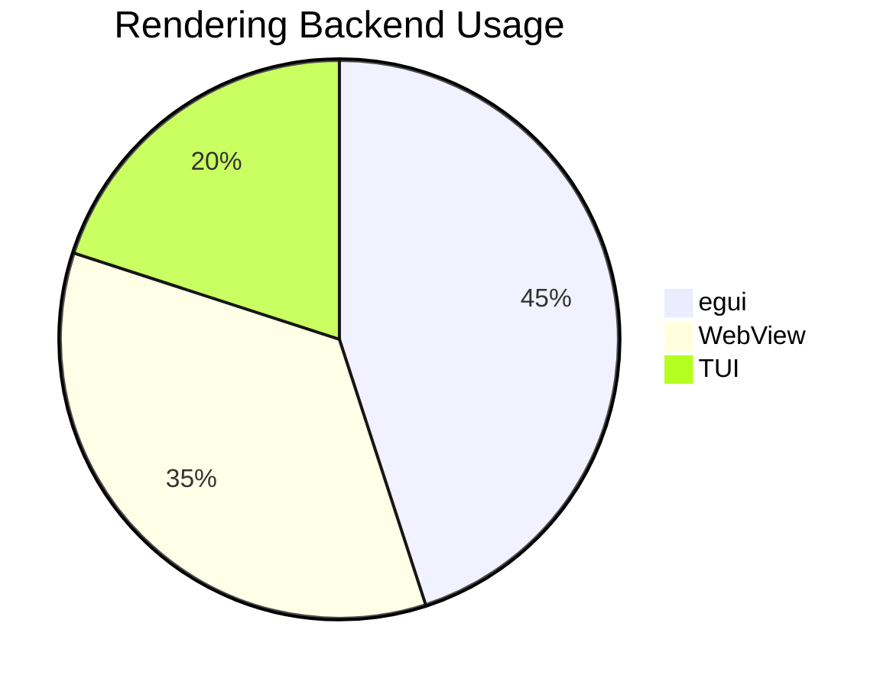

# Mermaid-Heavy Benchmark

This document contains multiple Mermaid diagrams to test diagram rendering performance.

## Flowchart

## Sequence Diagram

## Class Diagram

## State Diagram

## Gantt Chart

## Entity Relationship

## Pie Chart

End of mermaid-heavy document.
