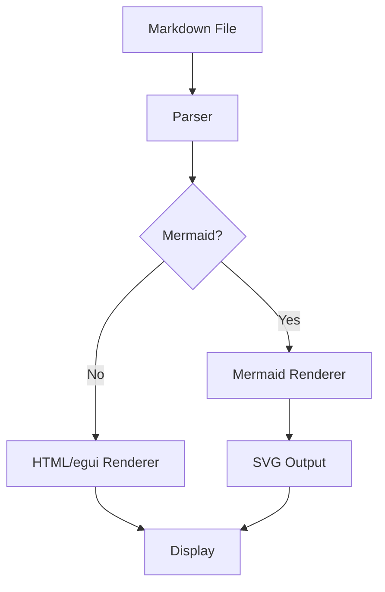

# MDR - Test Document

This is a **test document** for comparing rendering approaches.
Here's some *italic text* and ~~strikethrough~~.

## Code Example

```rust
fn main() {
    let greeting = "Hello, MDR!";
    println!("{}", greeting);

    for i in 0..5 {
        println!("Count: {}", i);
    }
}
```

## Table

| Feature | egui | WebView |
|---------|------|---------|
| Pure Rust | ✅ | ❌ |
| HTML/CSS rendering | ❌ | ✅ |
| Accessibility | ❌ | ✅ |
| Zero dependencies | ✅ | WebKit |

## Task List

- [x] Parse Markdown
- [x] Render headings
- [ ] Mermaid support
- [ ] File watching

## Mermaid Diagram



## Blockquote

> "The best tool is the one you actually use."
> — Someone wise

## Image Test

Here's an inline reference to a [link](https://example.com) and some `inline code`.

---

*End of test document*
